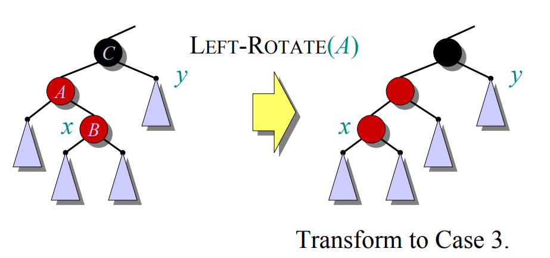

### 一、介绍

红黑树是一种自平衡的二叉搜索树，`n` 个节点的红黑树保证树的高度最多为 `2lg(n+1)` ，红黑树确保没有一条路径会比其他路径长出2倍，因而是近似于平衡的。

红黑树是具有下列着色性质的二叉查找树：
1. 每一个节点或者红色或者黑色.
2. 根和 `NULL` 是黑色.
3. 红色节点的父亲和儿子全部是黑色，即路径上没有连续的红色节点.
4. 从一个节点到 NULL 指针的每一条路径都必须包含相同数目的黑色节点. 


### 二、旋转


1. 旋转操作保证中序遍历顺序不变.
2. 旋转操作花费 O(1) 时间.


定义红黑树节点，
```c++
typedef struct rb_node rb_node;
struct rb_node {
    rb_node *left;
    rb_node *right;
    rb_node *parent;
    unsigned char color;
};
```

`typedef` 允许我们定义变量时可以省略`struct`关键词，旋转操作：

```c++
/**
 *       parent                       parent
 *        |                            |
 *        y    Right Rotate (y)        x      
 *       / \   ----------------->     / \   
 *      x   T3                      T1   y        
 *     / \      <--------------         / \
 *   T1   T2     Left Rotation(x)     T2   T3
 */
static void rbtree_right_rotate(rb_node **root, rb_node *y) {
    rb_node *x = y->left;
    rb_node *T2= x->right;
    rb_node *parent = y->parent;

    x->right = y;
    y->parent = x;

    y->left = T2;
    if (T2) T2->parent = y;

    x->parent = parent;
    if (parent) {
        if (y == parent->right)
            parent->right = x;
        else
            parent->left = x;
    } else
        *root = x;
}

static void rbtree_left_rotate(rb_node **root, rb_node *x) {
    rb_node *y = x->right;
    rb_node *T2= y->left;
    rb_node *parent = x->parent;

    y->left = x;
    x->parent = y;

    x->right = T2;
    if (T2) T2->parent = x;

    y->parent = parent;
    if (parent) {
        if (x == parent->left) 
            parent->left = y;
        else 
            parent->right = y;
    } else
        *root = y;
}
```


### 三、插入

插入 `x`，先把 `x` 涂成`红色`，一般会引起规则`3`冲突(有连续的红节点)，不断上浮这个冲突的点，直到通过旋转和重新着色解决冲突`3`.

例如，我们插入 `x = 15`，


插入操作的伪代码：
```c++
RB-INSERT(T, x)
    TREE-INSERT(T, x)
    color[x] ← RED                   ⊳ only property 3 can be violated
    while x ≠ root[T] and color[p[x]] = RED
        do if p[x] = left[p[p[x]]    ⊳ left case
            then y ← right[p[p[x]]   ⊳ y = aunt/uncle of x
                if color[y] = RED
                then 〈Case 1〉
                else if x = right[p[x]]
                     then 〈Case 2〉 ⊳ Case 2 falls into Case 3
                    〈Case 3〉
            else 〈“then” clause with “left” and “right” swapped〉
    color[root[T]] ← BLACK
```

性质`3`冲突时(`x`的父节点也为红色)，当父节点作为祖父节点的左子树时，存在以下三种情况：

#### case 1

`x` 的叔叔 `y` 是红色.

我们用一个紫色三角形代表一个`根是黑色`的子树，所有的子树具有`相同的黑高`.

为了保证性质`4`(黑高相同)，插入 `x` 时把它着色成红色，此时`A`-`B`发生冲突(性质`3`)，所以进行一次重新着色过程：把 `C`涂成红色，`C` 的儿子们涂成黑色，`C` 作为新的 `x`，继续下一次循环.


```c++
void rbt_insert(rb_node **root, rb_node *node) {
    rb_node *parent, *gparent;
    while ((parent = node->parent) && rbt_is_red(parent)) {
        gparent = parent->parent;
        if (parent == gparent->left) {
            rb_node *uncle = gparent->right;
            /* case 1 */
            if (uncle && rbt_is_red(uncle)) {
                rbt_set_black(uncle);
                rbt_set_black(parent);
                rbt_set_red(gparent);
                node = gparent;
                continue;
            }
```

#### case 2

`x` 的叔叔 `y` 是黑色，且 `x` 位于右子树的位置.

`y`不必单独画出，用一个紫色三角形表示.

此时进行一次`左旋`，让 `x` 位于右子树，退化成 `case 3`.



```c++
            /* case 2 */
            if (parent->right == node) {
                struct rb_node *tmp;
                rbtree_left_rotate(root, parent);
                tmp = parent;
                parent = node;
                node = tmp;
            }
```

#### case 3

`x` 的叔叔 `y` 是黑色，且 `x` 位于左子树的位置.

右旋，父节点变成黑色，兄弟变成红色.


```c++
            /* case 3 */
            rbt_set_black(parent);
            rbt_set_red(gparent);
            rbtree_right_rotate(root, gparent);
```

处理万以上三种情况后，把根节点设为黑色，

```c++
void rbt_insert(rb_node **root, rb_node *node) {
    rb_node *parent, *gparent;
    while ((parent = node->parent) && rbt_is_red(parent)) {
        gparent = parent->parent;
        if (parent == gparent->left) {
            rb_node *uncle = gparent->right;
            /* case 1 */
            if (uncle && rbt_is_red(uncle)) {
                /* ... */
                continue;
            }
            /* case 2 */
            if (parent->right == node) {
                /* ... */
            }
            /* case 3 */
            /* ... */
        } else {
            /* ... */
        }
    }
    /* 根节点设为黑色 */
    rbt_set_black(*root);
}
```


### 四、删除


